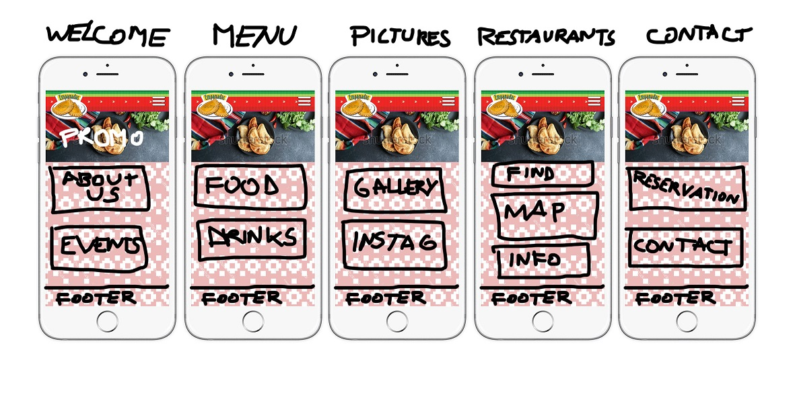

Link to [my restaurant](https://luisromeroaraya.github.io/restaurant-css-framework/)

# Restaurant [Challenge](https://github.com/becodeorg/BXL-Swartz-4-27/blob/master/1.The-Field/6.Bootstrap/restaurant.adoc)
* Type of challenge: **consolidation**
* Repository: **_restaurant-css-framework_**
* Duration: **4 day**
* Deadline: **02/02 - 17:00**
* Form: https://forms.gle/4F4u6QVLuCySSfTg7
* Team challenge: **solo**

## Missions objectives
At the end of this challenge you should have improved your:
* placement of element with **Bootstrap**

## The mission
Create a repository called *restaurant-css-framework* in which you must realise a window web page for a restaurant. The franchise is fictive, but the type of food (burger, pizza, asian, …) is your choice.

*(I will try to make a South American Empanada Restaurant)*

The website must be responsive, at least for small and medium screens. It must at least have five accessible pages: welcome, menu, pictures, restaurants and contact.

Welcome\
A page with one *Jumbotron* and two panels to show news (promo, events, etc…).

Menu\
A page with the restaurant menu in the form of a grouped list with badges.

Pictures\
A page with a gallery of minimum 10 pictures and a pagination (3 photos per page).

Restaurant\
A page about the restaurants (it’s a franchise) with its addresses, a map, and different schedules.

Contact\
A page with a contact form containing the firstname, lastname, email, subject of the message (a drop-down list with multiple options), an area for the message itself and a send button with an icon. Each entry as a title in a semantically correct tag.

*This is my first sketch:*

(The .psd file is [here](Mockup.psd)

If you want to make an even more complex website feel free to try new things and make it as beautiful as possible.

## Instructions
- [x] create the repository
- [x] write a good **README**
- [ ] don’t use a pre-made theme
- [ ] mention a description and the website URL on the top of the repo
- [ ] use ONLY royalty-free pictures AND credit in your readme the website where the pictures are from

## Advices
1. Read the instructions well.
1. Take time to prepare (prototype, content, pictures, …).
1. Go step by step, **HTML**, then classes and id and finally **CSS**.

## Optional
* use **SASS**

## Resources
* [README](https://tinyurl.com/y2nlxere)
* [glyphicons](http://glyphicons.com/)
